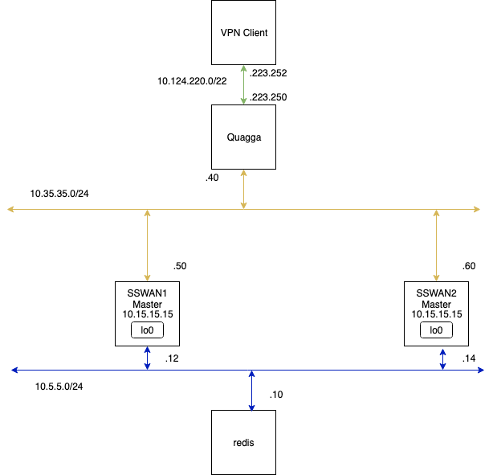

StrongSwan Session Scale Testing
================================

This directory contains Dockerfiles and scripts to build, run and test
the following containers:
* A StrongSwan container with the HA plugin enabled, operating as a
  master node.
* A StrongSwan container with the new JitIke plugin enabled, operating
  as a HA slave and integrating with Redis.
* A redis container.
* A haclient container to run the client VPN.
* A hafarend container running a container behind the VPN.

These do not run VPP, they use the standard StrongSwan Linux kernel
dataplanes.

Note that in the client container, we use network namespaces to run a
per-client ipsec. That configuration is handled roughly by the instructions
found [here](https://wiki.strongswan.org/projects/strongswan/wiki/Netns#Running-strongSwan-Inside-a-Network-Namespace).
The HA configuration for StrongSwan is based on the examples found on
[this page](https://wiki.strongswan.org/projects/strongswan/wiki/HighAvailability).

The configuration of the container is handled by the `env.list` file found
in this directory. To change this configuration, you can modify this file or
pass these individually on the command line when launching this container.

Network Layout
--------------

The built containers are networked as follows:



Accessing the nodes
-------------------

To access the Quagga node:

```
docker exec -it quagga telnet 127.0.0.1 2605
```

From there, you can examine the BGP session and routes:

```
show bgp summary
show ip bgp
```

Logging into a StrongSwan node (ha1m, ha1s, ha2m, or ha2s) and accessing redis
using the CLI requires you to pass `-h 10.5.5.10` to redis-cli since redis is not
running locally.

On client1 or client2, there is a script located at /scale.sh which allows you
to build out clients. Modify `MAXCOUNT` at the top of the script to change the
number of clients you create.
